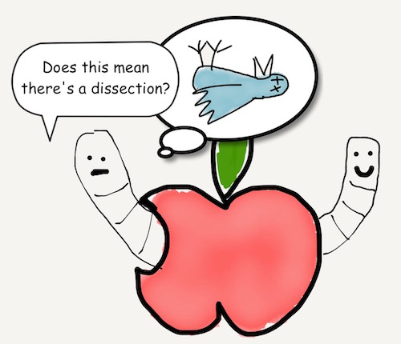

# Chapter 1
## Variables

The first step in being less intimidated of something, like Swift, is to start trying to understand it. We'll start to exploring Swift.



What’s a variable? It’s a placeholder for a value. Something for Swift to remember.

```javascript
var numberOfFeathers = 1000
```

Looking above, numberOfFeathers is a variable that holds the integer value of 1000. Specifically, we have 'declared' the numberOfFeathers variable, announcing to the world that it exists. We have also initialized numberOfFeathers, assigning numberOfFeathers a value of 1000.

There are several types of data: String, Int, Double, and so on.

```javascript
var numberOfFeathersInt = 1000
var numberOfFeathersDouble = 1000.0
var numberOfFeathersString = "a thousand"
```

In the above example we have implicit initialization, where Swift figures out the type of variable by the type of data that's assigned to it. However, users can explicitly initialize variables as well by telling Swift what type of data they are from the start.

```javascript
var numberOfFeathersInt: Int = 1000
var numberOfFeathersDouble: Double = 1000.0
var numberOfFeathersString: String = "a thousand"
```

Once you assign one type of value to a variable, from then on you can only assign the same type of data e.g. once you assign a String type value to a variable like “Hello”,  then you’ll only be able to assign String type values to that variable like “Goodbye”.

What if you don't have a value for the variable yet?

```javascript
var numberOfFeathersInt: Int
var numberOfFeathersDouble: Double
var numberOfFeathersString: String
```

The variables numberOfFeathersInt, numberOfFeathersDouble, and numberOfFeathersString are 'Optionals'. They may no may not hold data. By default, variables without a value are equal to nil.

You still need to make it clear what type of data the variable can hold. You can assign data later.

```javascript
var numberOfFeathers: Int
numberOfFeathers = 100
```

What if you want a variable never to change values?

```javascript
let veryImportantNumber = 43
```

veryImportantNumber is a constant. Constants are variables with one big difference. Once you assign a value, you can never change it again. Other than that, most concepts are the same as normal variables.

[Previous](start_here.md) [Next](01.md)


[Creative Commons Attribution-NonCommercial-ShareAlike 4.0 International License](http://creativecommons.org/licenses/by-nc-sa/4.0/)
