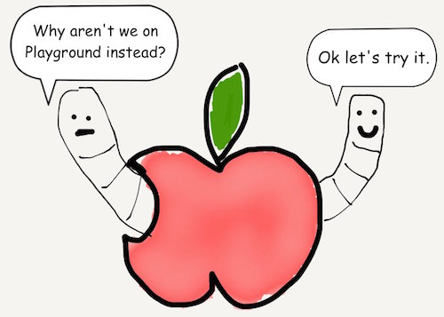

# Chapter 2
## Numbers

### Integers

Since we've already started using numbers in Swift, let's continue exploring them.

To increment an Int variable:

```javascript
var numberOfEggs = 1
numberOfEggs += 3
print(numberOfEggs)
```

Result:

```javascript
4
```

Decrementing an Int variable is similar:

```javascript
var numberOfEggs = 5
numberOfEggs -= 3
print(numberOfEggs)
```

Result:

```javascript
2
```



> ~~Worm 1: "Oh this is why"~~

> ~~Worm 2: "This isn't so bad. I like minimalism"~~

_Playground Version Coming Soon_

### Doubles (Floats)

Most operations that apply to Ints are the same for Doubles.

```javascript
var yolkPercentage = 49.46
yolkPercentage += 34.2
yolkPercentage -= 53.752
print(yolkPercentage)
```


[Previous](01.md) [Next](03.md)


[Creative Commons Attribution-NonCommercial-ShareAlike 4.0 International License](http://creativecommons.org/licenses/by-nc-sa/4.0/)
