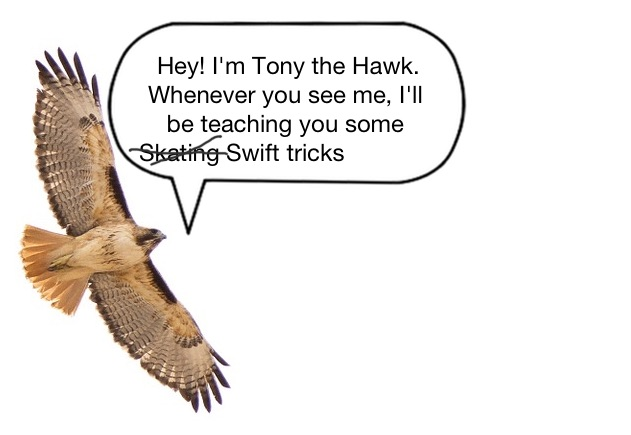

# Chapter 2
## Strings

How do you combine two different Strings?

```javascript
var firstPart = "The quick brown fox"
var secondPart = " jumped over the fence"
var foxySentence = firstPart + secondPart
// foxySentence "The quick brown fox jumped over the fence"
```

The above example creates a new String variable that is a combination of Strings 'firstPart' and 'secondPart'. What if you wanted to just wanted to change an existing String variable instead of creating a new one? Use the appendContentsOf method.

```javascript
var firstPart = "The quick brown fox"
var secondPart = " jumped over the fence"
secondPart.appendContentsOf(firstPart)
// secondPart "The quick brown fox jumped over the fence"
```

You can also add non-String variables to a String if you convert them as seen
below.

```javascript
var balloonSentence = " loft balloons"
var numberOfBalloons = 99
var nenaRefrain = String(numberOfBalloons) + balloonSentence
print(nenaRefrain)
//"99 loft balloons"
```

A more convenient way to insert variables into strings would be use use the backslash parens as shown below:

```javascript
var wings = 2
var claws = 2
var appleSummary = "I have \(wings) wings."
var fruitSummary = "I have \(wings + claws) appendages."
```



Some useful methods builtin String methods.

```javascript
var swiftSummary = "The swifts are a family, Apodidae, of highly aerial birds."
print(swiftSummary.hasPrefix("The swifts"))
print(swiftSummary.hasPrefix("aerial birds."))
//true
//true
```


[Previous](01.md) [Next](03.md)


[Creative Commons Attribution-NonCommercial-ShareAlike 4.0 International License](http://creativecommons.org/licenses/by-nc-sa/4.0/)
