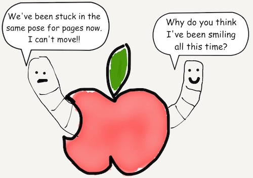

# Chapter 3
## Strings



How do you mix variable values into a String? You can add

```javascript
var firstPart = "The quick brown fox"
var secondPart = " jumped over the fence"
var foxySentence = firstPart + secondPart
```

foxySentence would equal:

```javascript
"The quick brown fox jumped over the fence"
```

You can also add non-String variables to a String if you convert them as seen
below.

```javascript
var balloonSentence = " loft balloons"
var numberOfBalloons = 99
var nenaRefrain = String(numberOfBalloons) + balloonSentence
```

nenaRefrain would equal:

```javascript
"99 loft balloons"
```

```javascript
var wings = 2
var claws = 2
var appleSummary = "I have \(wings) wings."
var fruitSummary = "I have \(wings + claws) appendages."
```

[Previous](02.md) [Next](03.md)

[Creative Commons Attribution-NonCommercial-ShareAlike 4.0 International License](http://creativecommons.org/licenses/by-nc-sa/4.0/)
