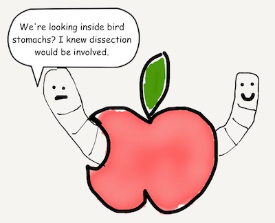

# Chapter 4
## Tuples

Tuples are ordered lists of data with a fixed number of elements.

```javascript
var swiftStomach = ("lady bug", "moth", 5334)
```

What do we mean by fixed number of elements? Tuples will always contain the same number of elements. Its size will never change.

How do you access parts of the tuple?

```javascript
var swiftStomach = ("lady bug", "moth", 5334)
print(swiftStomach.0)
print(swiftStomach.1)
print(swiftStomach.2)
```

Keeping in mind that counts start at 0 instead of 1, the result will be:

```javascript
"lady bug"
"moth"
5334
```

If you notice, tuple can contain multiple types of data.




Gotcha: when a tuple only contains one element, then it is not considered as a tuple. Instead it's treated as the data type of that one element.

```javascript
var swiftStomach = ("lady bug")
```

The above variable swiftStomach is not a tuple. It is a String.

For convenience, you can also name the elements inside a tuple.

```javascript
let personName = (first: "John", middle: "Bacon", last: "Smith")
print(personName.last)
print(swiftStomach.middle)
print(swiftStomach.first)
```
The result will be:

```javascript
"Smith"
"Bacon"
"John"
```

[Previous](03.md) [Next](05.md)


[Creative Commons Attribution-NonCommercial-ShareAlike 4.0 International License](http://creativecommons.org/licenses/by-nc-sa/4.0/)
