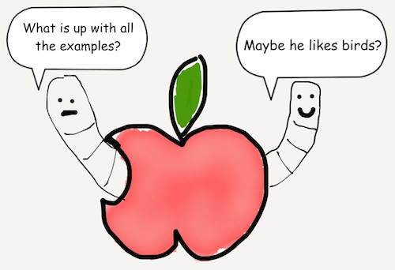

# Chapter 4
## Arrays

Arrays are similar to tuples. They can store multiple elements. However there are some key differences; we'll cover the differences through out this chapter.

### Setting Up

To initializing arrays, there are methods.

Here's an empty Array

```javascript
var swiftMouth = [String]()
```

How do you make the array's datatype explicit?

```javascript
var swiftMouth: [String] = ["lady bug", "moth", "beetle"]
var swiftBeak: Array<String> = ["lady bug", "moth", "beetle"]
```


Instead of using parens like tuples, arrays are declared with square brackets []. Moreover, an array can only store elements of the same type.

```javascript
var swiftMouth = ["lady bug", "moth", "beetle"]
```

You can have arrays within arrays as elements.

===TODO===

### Accessing

To access specific elements in the array, use the element's index number.

```javascript
var swiftMouth = ["lady bug", "moth", "beetle"]
print(swiftMouth[0])
print(swiftMouth[1])
print(swiftMouth[2])
```

The results should be:

```javascript
"lady bug"
"moth"
"beetle"
```

How can you check that an array is empty?

```javascript
var swiftMouth = ["lady bug", "moth", "beetle"]
print(swiftMouth.isEmpty)
print(swiftMouth.count)
swiftMouth = []
print(swiftMouth.isEmpty)
print(swiftMouth.count)
```
The end result would be

```javascript
false
3
true
0
```

There are other ways to access array elements which will be covered in a later chapter.

As for iteration, to visit each of the set's elements one by one, we will cover that in the next chapter.

### Modifying

Another key difference between tuples and arrays is that an array's size can change. To add elements:

```javascript
var swiftMouth = ["lady bug", "moth", "beetle"]
swiftMouth.append("butterfly")
print(swiftMouth)
```

The end result would be

```javascript
["lady bug", "moth", "beetle", "butterfly"]
```

You can also add more than one element at a time.

```javascript
var swiftMouth = ["lady bug", "moth", "beetle"]
swiftMouth += ["butterfly", "house fly"]
print(swiftMouth)
```

The end result would be

```javascript
["lady bug", "moth", "beetle", "butterfly", "house fly"]
```

To remove elements:

```javascript
var swiftMouth = ["lady bug", "moth", "beetle"]
swiftMouth.remove("beetle")
print(swiftMouth)
```

Then you'd have:

```javascript
["lady bug", "moth"]
```



Now that we're familiar with arrays, here's a useful String method.

```javascript
let placesForMigration = ["Brazil", "Florida", "Mexico"]
print(placesForMigration.joinWithSeparator(", "))
```


[Previous](03.md) [Next](05.md)


[Creative Commons Attribution-NonCommercial-ShareAlike 4.0 International License](http://creativecommons.org/licenses/by-nc-sa/4.0/)
