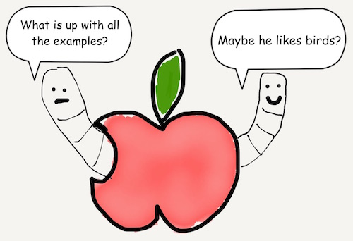

# Chapter 5
## Arrays

Arrays are similar to tuples. They can store multiple elements. However there are some key differences; we'll cover the differences later. For now we'll go over the basics.

To initializing arrays, there are methods.

Here's an empty Array

```javascript
var swiftMouth = [String]()
```


How do you make the array's datatype explicit?

```javascript
var swiftMouth: [String] = ["lady bug", "moth", "beetle"]
var swiftBeak: Array<String> = ["lady bug", "moth", "beetle"]
```


Instead of parens, arrays are declared with square brackets []. Moreover, an array can only store elements of the same type.

```javascript
var swiftMouth = ["lady bug", "moth", "beetle"]
```

Another key difference is that an array's size can change. To add elements:

```javascript
var swiftMouth = ["lady bug", "moth", "beetle"]
swiftMouth.append("butterfly")
print(swiftMouth)
```

The end result would be

```javascript
["lady bug", "moth", "beetle", "butterfly"]
```

To remove elements:

```javascript
var swiftMouth = ["lady bug", "moth", "beetle"]
swiftMouth.remove("beetle")
print(swiftMouth)
```

Then you'd have:

```javascript
["lady bug", "moth"]
```



How can you check that an array is empty?

```javascript
var swiftMouth = ["lady bug", "moth", "beetle"]
print(swiftMouth.isEmpty)
swiftMouth = []
print(swiftMouth.isEmpty)
```
The end result would be

```javascript
false
true
```


[Previous](04.md) [Next](06.md)


[Creative Commons Attribution-NonCommercial-ShareAlike 4.0 International License](http://creativecommons.org/licenses/by-nc-sa/4.0/)
