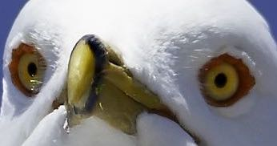
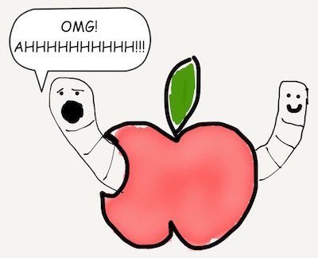
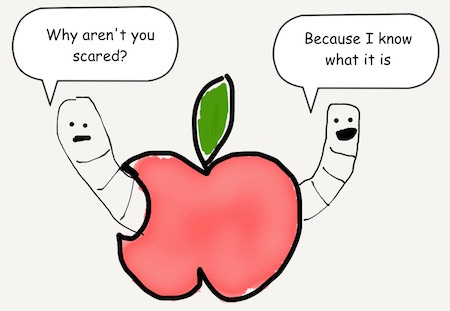
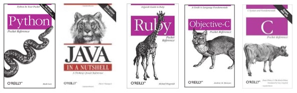
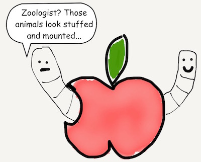

(work in progress)

# What is this?!

<!-- [Show two worms]
[Angie ‘Because I know what it is.’]
[Angie ‘Let’s allow the Author to explain’] -->

If you’re reading this, you want to learn something that may be scary or intimidating to you; something called Swift. The goal of this tutorial is to help you become more familiar with Swift and hopefully less intimidated by it. (If you’re an experienced zoologist, you probably don’t need to read this unless you’re doing it for fun.)

[Next](01.md)

[Creative Commons Attribution-NonCommercial-ShareAlike 4.0 International License](http://creativecommons.org/licenses/by-nc-sa/4.0/)
